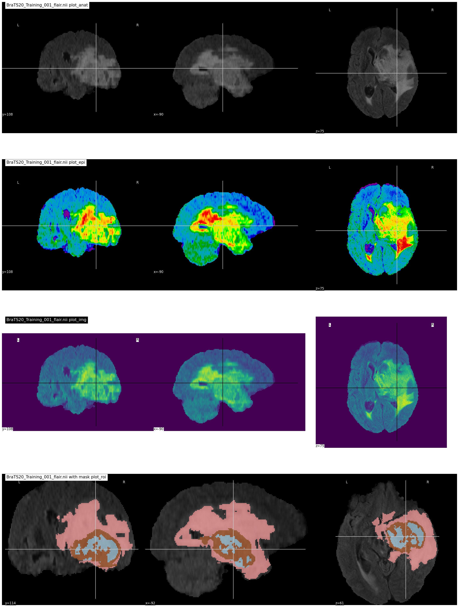
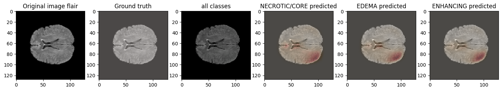
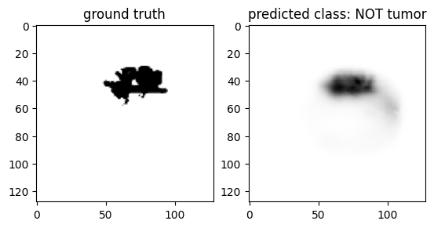

## 3D Brain Segementation

- We segment 3 different types of Cancer each one have specific properties (NECROTIC/CORE, EDEMA, ENHANCING)

## Features
### Four different segmentation techniques

- FLAIR segmentation
- T1 Segmentation
- T1ce Segmentation
- T2 Segmentation
- Using U-Net model

## Toolkits

- Python
- Tensorflow

## Data Visualization

- Different Segmentations

- Testing

